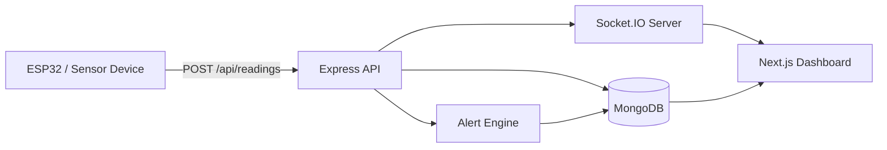

# IoT Monitoring Dashboard

<div align="center">

Real-time full-stack monitoring platform for connected devices, live telemetry, alert management, and secure operator access.

<br />


</div>

## Overview

This project is a full-stack IoT monitoring system built for tracking device activity in real time. It combines a `Next.js` dashboard with an `Express + MongoDB + Socket.IO` backend to monitor device status, ingest sensor readings, detect anomalies, and surface actionable alerts.

It is designed for scenarios where operators need a live view of connected hardware, recent telemetry, and alert history from a secure browser-based dashboard.

## Highlights

- Real-time device monitoring with Socket.IO updates
- Secure authentication flow with signup and login
- Live telemetry dashboard for each device
- Reading history with filtering and pagination
- Alert center with open alerts, history, and clear actions
- Automatic offline detection for inactive devices
- Threshold-based alert generation for weight, vibration, and Wi-Fi quality
- ESP32-style simulator script for testing device ingestion locally
- Deployment-ready structure for `Vercel` frontend + `Render/Railway` backend

## Demo Architecture



## Core Features

### Authentication

- User signup
- User login
- JWT-based protected API routes
- Local auth persistence in the frontend

### Device Monitoring

- Latest device listing
- Device-specific dashboard view
- Online/offline state tracking
- Last seen, uptime, IP address, Wi-Fi signal, buzzer state, LED state

### Telemetry & History

- Reading ingestion endpoint for hardware devices
- Paginated reading history
- Filtering by vibration and date
- Sort order controls for timeline inspection

### Alerts & Automation

- Open alerts view
- Historical alerts view
- Clear single alert
- Clear all active alerts for a device
- Automatic alert creation for:
  - vibration detected
  - overweight
  - underweight
  - weak Wi-Fi signal
  - device offline

### Realtime UX

- Live updates for telemetry changes
- Device state sync over websockets
- Alert creation and alert status updates in real time

## Tech Stack

### Frontend

- Next.js 15
- React 19
- App Router
- Socket.IO client

### Backend

- Node.js
- Express 5
- MongoDB + Mongoose
- Socket.IO
- JWT authentication
- Morgan logging

## Project Structure

```text
.
├── backend
│   ├── scripts
│   │   └── esp32-simulator.js
│   ├── src
│   │   ├── config
│   │   ├── constants
│   │   ├── jobs
│   │   ├── middleware
│   │   ├── modules
│   │   │   ├── alert
│   │   │   ├── auth
│   │   │   ├── device
│   │   │   └── reading
│   │   ├── utils
│   │   ├── app.js
│   │   └── server.js
│   └── package.json
├── frontend
│   ├── app
│   ├── components
│   ├── context
│   ├── hooks
│   ├── lib
│   ├── utils
│   └── package.json
├── .gitignore
└── package.json
```

## UI Modules

- `DashboardShell`: main dashboard layout
- `DeviceSelector`: switches the active device
- `LiveStatusCard`: shows live telemetry and online state
- `ReadingHistory`: shows historical readings with filters and pagination
- `AlertsList`: shows open/history alerts and clear actions

## API Overview

Base URL:

```text
/api
```

### Public Routes

| Method | Route | Purpose |
| --- | --- | --- |
| `POST` | `/api/auth/signup` | Create a new user |
| `POST` | `/api/auth/login` | Login and receive JWT |
| `POST` | `/api/readings` | Ingest a device reading |
| `GET` | `/health` | Health check |

### Protected Routes

| Method | Route | Purpose |
| --- | --- | --- |
| `GET` | `/api/device/latest` | Latest device states |
| `GET` | `/api/device/:deviceId` | Device details |
| `GET` | `/api/readings` | Reading history |
| `GET` | `/api/readings/latest` | Latest reading |
| `GET` | `/api/alerts` | Open alerts |
| `GET` | `/api/alerts/history` | Alert history |
| `GET` | `/api/alerts/recent` | Recent alerts |
| `PATCH` | `/api/alerts/:alertId/clear` | Clear one alert |
| `PATCH` | `/api/alerts/clear-all` | Clear all open alerts |

## Example Reading Payload

This is the payload shape expected by `POST /api/readings`:

```json
{
  "deviceId": "ESP32_SIM_001",
  "weight": 12.45,
  "vibration": false,
  "buzzerOn": false,
  "ledOn": false,
  "wifiSignal": -58,
  "uptime": 1543,
  "ipAddress": "192.168.1.22",
  "timestamp": "2026-04-12T10:00:00.000Z"
}
```

## Realtime Events

The backend emits these events through Socket.IO:

- `reading:update`
- `device:update`
- `alert:new`
- `alert:update`
- `device:subscribe`
- `device:unsubscribe`

## Local Development

### 1. Clone the repository

```bash
git clone https://github.com/nikhildhimann/iot-monitoring-dashboard.git
cd iot-monitoring-dashboard
```

### 2. Install dependencies

```bash
npm run install:all
```

### 3. Create environment files

```bash
cp backend/.env.example backend/.env
cp frontend/.env.example frontend/.env.local
```

### 4. Start the backend

```bash
npm run dev:backend
```

### 5. Start the frontend

```bash
npm run dev:frontend
```

### Local URLs

- Frontend: `http://localhost:3000`
- Backend: `http://localhost:5000`
- Health check: `http://localhost:5000/health`

## Root Scripts

| Command | Purpose |
| --- | --- |
| `npm run install:all` | Install frontend and backend dependencies |
| `npm run dev:backend` | Start backend in development mode |
| `npm run dev:frontend` | Start frontend in development mode |
| `npm run build:frontend` | Build frontend for production |
| `npm run start:backend` | Start backend in production mode |
| `npm run start:frontend` | Start frontend in production mode |

## Environment Variables

### Backend

Use [`backend/.env.example`](backend/.env.example) as the source of truth.

| Variable | Required | Description |
| --- | --- | --- |
| `PORT` | Yes | Backend port |
| `MONGO_URI` | Yes | MongoDB connection string |
| `JWT_SECRET` | Yes | Secret used to sign JWT tokens |
| `JWT_EXPIRES_IN` | No | JWT expiry, default is `7d` |
| `CLIENT_URLS` | Yes | Comma-separated allowed frontend origins |
| `NODE_ENV` | Yes | `development` or `production` |
| `WEIGHT_MIN_THRESHOLD` | No | Minimum weight threshold |
| `WEIGHT_MAX_THRESHOLD` | No | Maximum weight threshold |
| `WIFI_SIGNAL_WEAK_THRESHOLD` | No | Weak signal threshold in dBm |
| `DEVICE_OFFLINE_AFTER_MS` | No | Time after which a device is considered offline |
| `DEVICE_OFFLINE_CHECK_INTERVAL_MS` | No | Offline checker interval |

### Frontend

Use [`frontend/.env.example`](frontend/.env.example) as the source of truth.

| Variable | Required | Description |
| --- | --- | --- |
| `NEXT_PUBLIC_API_URL` | Yes | Backend REST API base URL |
| `NEXT_PUBLIC_SOCKET_URL` | Yes | Backend Socket.IO base URL |

## ESP32 Simulator

The simulator lets you test the backend and dashboard without real hardware.

### Run the simulator

```bash
node backend/scripts/esp32-simulator.js
```

### Optional simulator environment variables

| Variable | Description | Default |
| --- | --- | --- |
| `API_URL` | Ingestion endpoint | `http://localhost:5000/api/readings` |
| `DEVICE_ID` | Device identifier | `ESP32_SIM_001` |
| `MIN_DELAY_MS` | Minimum delay between payloads | `2000` |
| `MAX_DELAY_MS` | Maximum delay between payloads | `5000` |
| `MAX_MESSAGES` | Stop after N payloads, `0` means unlimited | `0` |

Example:

```bash
DEVICE_ID=ESP32_TEST_01 MAX_MESSAGES=20 node backend/scripts/esp32-simulator.js
```

## Production Readiness

This project already includes several production-oriented improvements:

- environment-based API and websocket configuration
- root and folder-level `.gitignore` setup
- health check endpoint
- CORS origin allowlisting
- proxy-safe backend config for hosted deployments
- standalone Next.js build output
- env examples for frontend and backend
- graceful backend shutdown handling
- automatic offline device detection job

## Deployment Guide

### Recommended Setup

- Deploy `frontend/` on `Vercel`
- Deploy `backend/` on `Render` or `Railway`
- Use `MongoDB Atlas` for the database

### Backend Deployment

Project settings:

- Root directory: `backend`
- Install command: `npm install`
- Start command: `npm start`
- Health check path: `/health`

Required env vars:

```env
PORT=5000
MONGO_URI=your-mongodb-uri
JWT_SECRET=your-secure-secret
JWT_EXPIRES_IN=7d
CLIENT_URLS=https://your-frontend-domain.vercel.app
NODE_ENV=production
```

### Frontend Deployment

Project settings:

- Root directory: `frontend`
- Build command: `npm run build`
- Start command: `npm start`

Required env vars:

```env
NEXT_PUBLIC_API_URL=https://your-backend-domain.com/api
NEXT_PUBLIC_SOCKET_URL=https://your-backend-domain.com
```

## Suggested Test Flow

1. Start backend and frontend locally
2. Create a user account
3. Login to the dashboard
4. Run the ESP32 simulator
5. Watch devices appear in the selector
6. Confirm live telemetry updates
7. Confirm alerts open when thresholds are crossed
8. Clear alerts and inspect alert history

## Response Format

Most backend endpoints use a consistent shape:

```json
{
  "success": true,
  "message": "Request completed successfully",
  "data": {},
  "meta": {}
}
```

## GitHub Notes

The repository is configured to ignore:

- `node_modules`
- `.next`
- `.env`
- logs
- local helper/cache files

This keeps commits clean and makes GitHub uploads much faster.

## License

This project is licensed under the `ISC` license.
